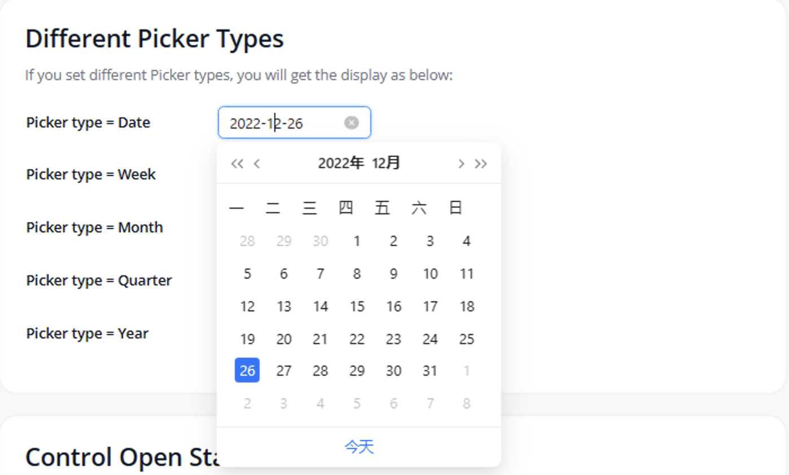
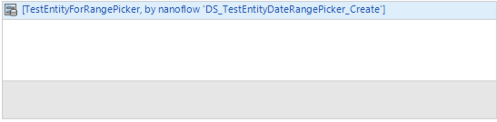
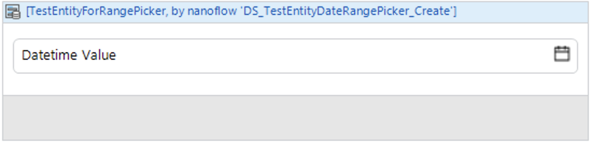
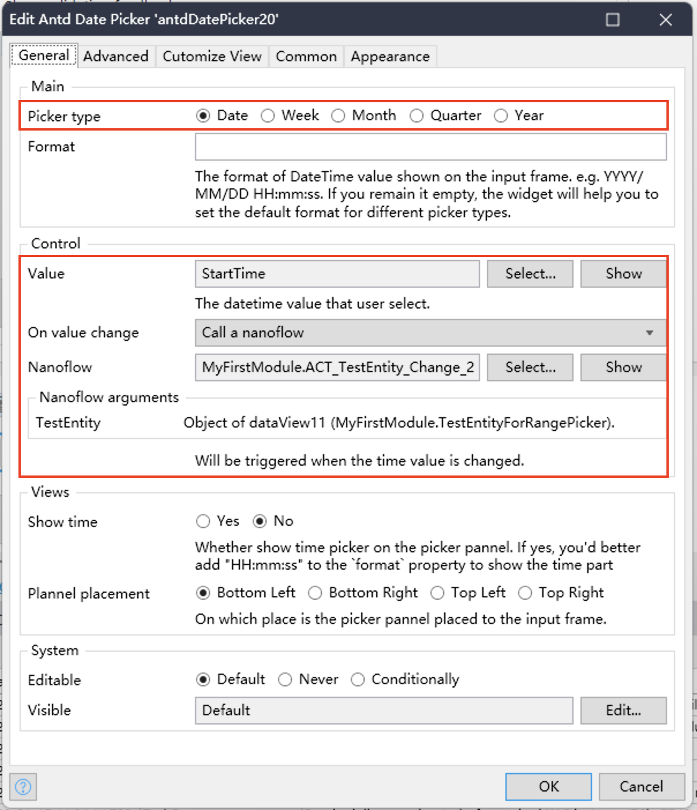
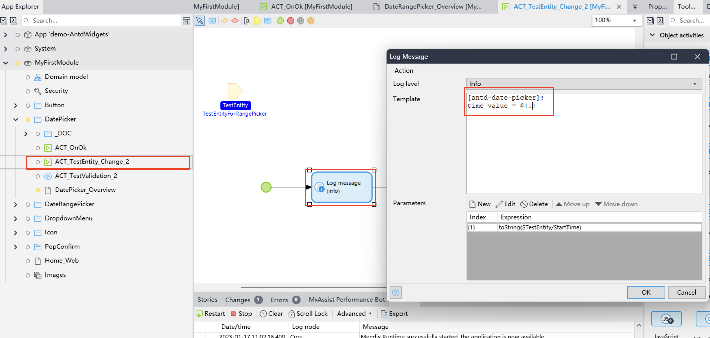
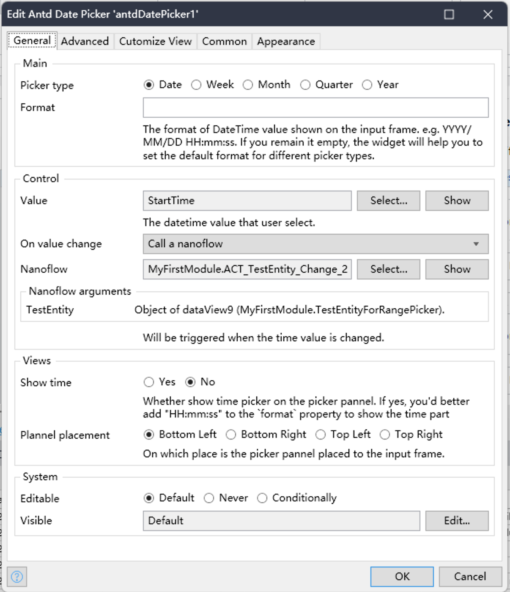
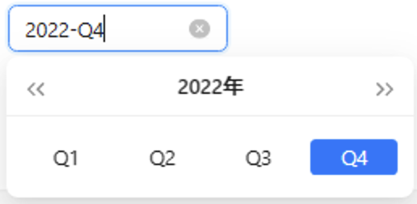
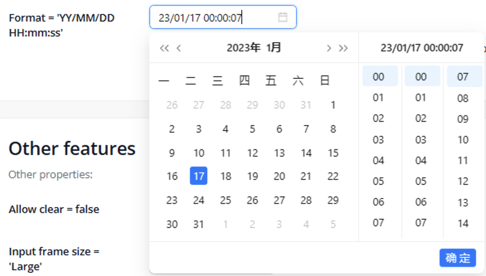
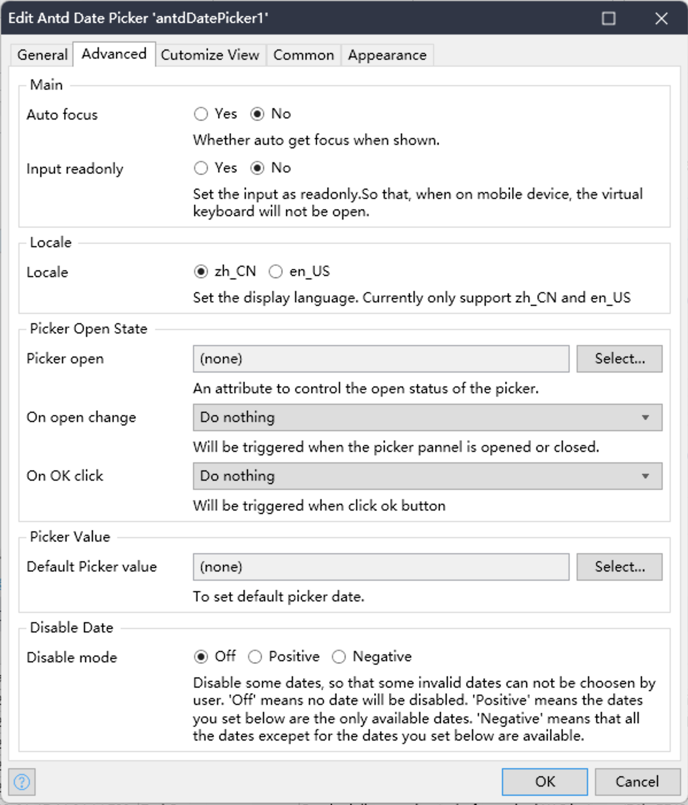
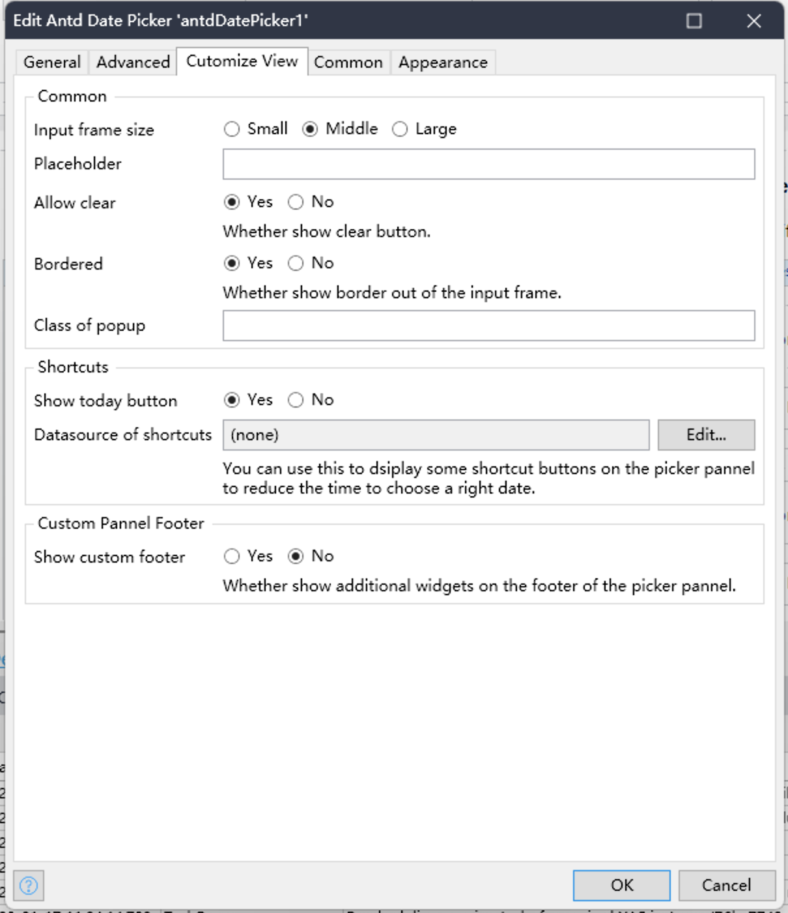

## Introducation

[中文文档](./README-CN.md)  

AntdDatePicker ([Github](https://github.com/zjh1943/mendix-antd-date-picker)) is a powerful Mendix pluggable widget used to pick date and time. It brings the [DatePicker](https://ant.design/components/date-picker-cn#rangepicker) widget from Ant Design into Mendix and implements almost all the features of the original widget.

## Features
1. Support multiple time unit choices, including: `date`, `week`, `month`, `quarter`, `year`.
2. Support custom date display format, such as: `yyyy-DD-mm`, `dddd-DD-mm hh:MM:ss`. 2.
2. Support adding cutomized shortcut buttons to select time period with one click.
3. support time selection accurate to hours, minutes and seconds.
4. Support setting non-selectable dates. 
5. Support multiple languages. 
6. Support Mendix's Validation Feedback feature.

## Quick Use

<h3>1. Add this widget to the Mendix Project</h3>

1. Download the mpk file from [here](https://github.com/zjh1943/mendix-antd-date-picker/releases).
3. Copy the mpk file to your Mendix Project directory `{YourMendixProjectFolder}/widgets/`.
4. Open your Mendix Project with Mendix Studio Pro and click on the menu `Menu > App > Synchronize App Directory`.

<h3>2. Set properties of the widget</h3>

1. Select any page, add a `DataView` to the page, and set the `Datasource` for the `DataView`. The Datasource should be an Entity that having at least 1 DateTime attribute.
2. Add the `Antd Date Picker` widget to the `DataView` above. It can be found in the Toolbox on the right side of Mendix Studio Pro. 
3. Set the necessary properties for the widget, including `Picker Type`, `Start time`, `End time`, `On value change` :
    * Set `Picker type`. Select the default `Date` type.
    * Set `Time value` as an DateTime attribute of the Datasource entity. This property is used to set and read the time value of the widget.
    * Set `On value change` to `Nanoflow` and choose `create a new Nanoflow`. 
    * Read and print the `Start time` and `End time` properties in this `Nanoflow`. 
4. Run.

## Demo project

1. You can access the online demo from [here](https://demo-antdwidgets100.apps.ap-2a.mendixcloud.com) to show the features of this widget.   
2. You can also download the demo project from [here](https://github.com/zjh1943/mendx-antd-widgets-show) to run it on your own PC.
    
## Datail of properties

### General

Properties to control the most important behaviors or display of the widget. You will definitely use most of these properties when you add this widget into a page.

Click to show the detail

* Picker type. Support values: `date`, `week`, `month`, `quarter`, `year`. If you set it as `quarter`，you picker will display like this: 
* Format. The format of DateTime value shown on the input frame. e.g. YYYY/MM/DD HH:mm:ss.
* Value. The datetime value that user select. You need to choose a attribute of a entity.
* On value Change. Will be triggered when the time value is changed.
* Show time. Whether show time picker on the picker pannel. If yes, you'd better add "HH:mm:ss" to the `format` property to show the time part. It looks like this: 
* Plannel placement. On which place is the picker pannel placed to the input frame. support values like: Bottom Left, Bottom Right, Top Left, Top Right.

### Advanced

Properties to control the behavior of the widget, which is not must for normal using.

Click to show the detail

* Main.
    * Auto focus. Whether auto get focus when shown.
    * Input readonly. Set the input as readonly.So that, when on mobile device, the virtual keyboard will not be open.
* Locale.
    * Locale. Set the display language. Currently only support zh_CN and en_US.
* Picker Open State.
    * Picker open. An attribute to control the open status of the picker.
    * On open change. Will be triggered when the picker pannel is opened or closed.
    * On OK cick. Will be triggered when click ok button. The ok button will be showd when "Show time" is true.
* Picker Value. (not support any more)
    * Default Picker value. The default time value on the picker pannel.
* Disable Date. 
    * Disable mode. Disable some dates, so that some invalid dates can not be choosen by user. 
        - 'Off' means no date will be disabled. 
        - 'Positive' means the dates you set below are the only available dates. 
        - 'Negative' means that all the dates excepet for the dates you set below are available.
    * Disable datasource. Choose the object list of dates you want to disable or enable.
    * Disable attribute. Choose the attribute with type of DateTime to diable or enable a date.

### Customize View

Properties to customize the view of the widget.

Click to show the detail

* Common.
    - size. Input frame size. Support value: Small, Middle, Large.
    - Placeholder.
    - Allow clear. Whether show clear button.
    - Bordered. Whether show border out of the input frame.
    - Class of popup. CSS class of the popup DOM element.
* Shortcuts. 
    - Show today button. Whether to show 'Today' button on panel.
    - Show now button. Whether to show 'Now' button on panel when show time is set as true.
    - Datasource of shortcuts. You can use this to dsiplay some shortcut buttons on the picker pannel to let user choose common dates by one click.
    - Attribute of label. Label will be shown on the shortcut button.
    - Value Attribute. When user click the shortcut button, the corresponding datetime will be selected.  
* Custom Pannel Footer
    - Show custom footer. Whether show additional widgets on the footer of the picker pannel.
    - Custom pannel footer. Put additional widgets on the footer of the picker pannel.

## Comparison with `antd` `RangePicker` features

Click to show detail

| Property              | Property Description                                                                                                                                                             | Property Type                                                             | Implement or not |
| --------------------- | -------------------------------------------------------------------------------------------------------------------------------------------------------------------------------- | ------------------------------------------------------------------------- | ---------------- |
| allowClear            | Whether to show clear button                                                                                                                                                     | boolean                                                                   | Y                |
| autoFocus             | If get focus when component mounted                                                                                                                                              | boolean                                                                   | Y                |
| bordered              | Whether has border style                                                                                                                                                         | boolean                                                                   | Y                |
| className             | The picker className                                                                                                                                                             | string                                                                    | Y                |
| dateRender            | Custom rendering function for date cells                                                                                                                                         | function(currentDate: dayjs, today: dayjs) => React.ReactNode             | N                |
| disabled              | Determine whether the DatePicker is disabled                                                                                                                                     | boolean                                                                   | Y                |
| disabledDate          | Specify the date that cannot be selected                                                                                                                                         | (currentDate: dayjs) => boolean                                           | Y                |
| popupClassName        | To customize the className of the popup calendar                                                                                                                                 | string                                                                    | Y                |
| getPopupContainer     | To set the container of the floating layer, while the default is to create a div element in body                                                                                 | function(trigger)                                                         | N                |
| inputReadOnly         | Set the readonly attribute of the input tag (avoids virtual keyboard on touch devices)                                                                                           | boolean                                                                   | Y                |
| locale                | Localization configuration                                                                                                                                                       | object                                                                    | Y                |
| mode                  | [The picker panel mode（ Cannot select year or month anymore? )](https://ant.design/docs/react/faq#When-set-mode-to-DatePicker/RangePicker,-cannot-select-year-or-month-anymore?) | time | date | month | year| decade                                        | N                |
| nextIcon              | The custom next icon                                                                                                                                                             | ReactNode                                                                 | N                |
| open                  | The open state of picker                                                                                                                                                         | boolean                                                                   | Y                |
| panelRender           | Customize panel render                                                                                                                                                           | (panelNode) => ReactNode                                                  | N                |
| picker                | Set picker type                                                                                                                                                                  | date | week | month | quarter | year                                      | Y                |
| placeholder           | The placeholder of date input                                                                                                                                                    | string | [string,string]                                                  | Y                |
| placement             | The position where the selection box pops up                                                                                                                                     | bottomLeft bottomRighttopLeft topRight                                    | Y                |
| popupStyle            | To customize the style of the popup calendar                                                                                                                                     | CSSProperties                                                             | Y                |
| presets               | The preset ranges for quick selection                                                                                                                                            | [{ label: React.ReactNode, value: dayjs }[]](https://day.js.org/)         | N                |
| prevIcon              | The custom prev icon                                                                                                                                                             | ReactNode                                                                 | Y                |
| size                  | To determine the size of the input box, the height of large and small, are 40px and 24px respectively, while default size is 32px                                                | large | middle | small                                                    | Y                |
| status                | Set validation status                                                                                                                                                            | 'error' | 'warning'                                                       | Y                |
| style                 | To customize the style of the input box                                                                                                                                          | CSSProperties                                                             | Y                |
| suffixIcon            | The custom suffix icon                                                                                                                                                           | ReactNode                                                                 | N                |
| superNextIcon         | The custom super next icon                                                                                                                                                       | ReactNode                                                                 | N                |
| superPrevIcon         | The custom super prev icon                                                                                                                                                       | ReactNode                                                                 | N                |
| onOpenChange          | Callback function, can be executed whether the popup calendar is popped up or closed                                                                                             | function(open)                                                            | Y                |
| onPanelChange         | Callback when picker panel mode is changed                                                                                                                                       | function(value, mode)                                                     | N                |
| defaultPickerValue    | To set default picker date                                                                                                                                                       | [dayjs](https://day.js.org/)                                              | N                |
| defaultValue          | To set default date, if start time or end time is null or undefined, the date range will be an open interval                                                                     | [dayjs](https://day.js.org/)                                              | N                |
| disabledTime          | To specify the time that cannot be selected                                                                                                                                      | function(date)                                                            | Y                |
| format                | To set the date format, refer to dayjs. When an array is provided, all values are used for parsing and first value is used for formatting, support Custom Format                 | string | (value: dayjs) => string | (string | (value: dayjs) => string)[] | Y                |
| renderExtraFooter     | Render extra footer in panel                                                                                                                                                     | (mode) => React.ReactNode                                                 | Y                |
| showNow               | Whether to show 'Now' button on panel when showTime is set                                                                                                                       | boolean                                                                   | Y                |
| showTime              | To provide an additional time selection                                                                                                                                          | object | boolean                                                          | Y                |
| showTime.defaultValue | [To set default time of selected date, demo](https://ant.design/components/date-picker#components-date-picker-demo-disabled-date)                                                | [dayjs](https://day.js.org/)                                              | N                |
| showToday             | Whether to show Today button                                                                                                                                                     | boolean                                                                   | Y                |
| value                 | To set date                                                                                                                                                                      | [dayjs](https://day.js.org/)                                              | Y                |
| onChange              | Callback function, can be executed when the selected time is changing                                                                                                            | function(date: dayjs, dateString: string)                                 | Y                |
| onOk                  | Callback when click ok button                                                                                                                                                    | function()                                                                | Y                |

## Issues, suggestions and feature requests

[Github Issue](https://github.com/zj1943/mendix-antd-date-picker/issues)

At the same time, your are welcome to get into the China Technology Forum to get more in Mendix widget development. [check this out](https://marketplace.siemens.com.cn/low-code-community)

## Development and contribution

1. Install NPM package dependencies by using: `npm install`. If you use NPM v7.x.x, which can be checked by executing `npm -v`, execute: `npm install --legacy-peer-deps`.
1. Run `npm start` to watch for code changes. On every change:
    - the widget will be bundled;
    - the bundle will be included in a `dist` folder in the root directory of the project;
    - the bundle will be included in the `deployment` and `widgets` folder of the Mendix test project.

